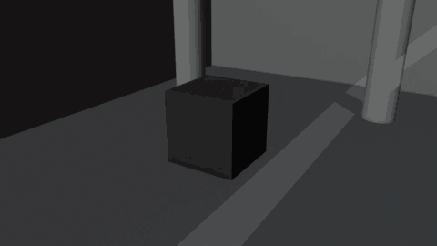
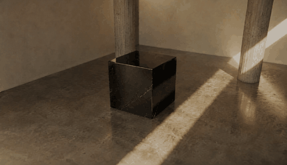
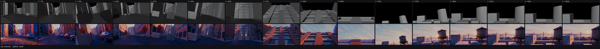

# shotops

**Shots as source code.** An agent authors a 3D scene and camera as a config
file, Blender renders a grey blockout from it, and a video model turns that
blockout into the finished shot — so the shot has a diff, a history and a
revert, the way software does.

## The first artifact

| in — Blender blockout | out — Seedance 2 mini |
| --- | --- |
|  |  |

Same dolly, same silhouette, same screen position, same raking light slot. Only
material, lighting and colour changed — which is the whole claim, and the two
clips above are the form of it that can actually be falsified.

Left is rendered locally and costs nothing. The only authored input is
[`projects/demo/sequences/seq_010/sh_0020/room.json`](projects/demo/sequences/seq_010/sh_0020/room.json): 127 lines holding ten
primitives, a 32mm camera that dollies from 13.7m to 8.4m while dropping from
6.0m to 1.8m, and a prompt describing surfaces. 5s, 480p.

Full quality, not palette-reduced: [`blockout.mp4`](docs/blockout.mp4) (237 KB),
[`final.mp4`](docs/final.mp4) (1.3 MB).

### The second reference

<table>
<tr>
<td width="42%"></td>
<td valign="top">

Colour and light do not come from the prompt alone. A **style still** carries
them — and it is made by restyling the blockout's own first frame, so the camera,
the framing and the objects are already identical.

That keeps the two references from arguing: the blockout owns everything
spatial, the still owns everything about look. A picture generated from text
would invent its own composition and pull against the blockout instead.

</td>
</tr>
</table>

## The second shot, and the first honest failure

*2026-08-25.* A harder test: ten seconds instead of five, a 48-object street
built from primitives, and a 20mm camera that runs 112 m down a dead-end at
80 km/h, weaves twice, climbs a wall and crests a roof. Blockout on top, result
below, at matched times.



**What it settled.** Above the roof line the geometry is *empty* — there is no
bay, no bridge, no sunset, no distant skyline anywhere in the scene. All four
came from the prompt and stayed put for the whole reveal. A backdrop that only
appears at the end of a move does not have to be built.

**What it broke.** From roughly 20% to 40% two raw white boxes sit in the road,
untextured, while the buildings and kerbs around them are fully rendered. They
are the two cars standing out in the traffic lane — the closest geometry in the
shot, passed at 0.85 m to sell the speed.

The cause is not that a cube is a poor car. It is that **the two references were
handed contradictory accounts of the same surface**: the blockout said *there are
objects standing here*, the style still said *the road is empty*, and the style
still is what the model was told to take material from. There was no material for
a thing the look reference does not contain. Proximity is the other half — the
same cubes read as parked cars perfectly well at twenty metres along the kerb,
where the street supplies the answer; at under a metre, filling a third of frame,
there is no context left and nothing in a 1.9 × 4.6 m box to infer from.

Which is the useful shape of the finding, because it is a rule rather than a
verdict: **a primitive only has to look like its object at the distance it is
seen from — and the style reference has to contain that object at all.**

Full account with the provider log in
[`generations.md`](projects/nyc/sequences/seq_010/sh_0010/generations.md); what
building the blockout taught is in
[`notes.md`](projects/nyc/sequences/seq_010/sh_0010/notes.md).

## Three strands

The project is early, and it is deliberately three things at once, because
separately none of them is worth much.

**1 — AI rendering, from blocking to generation.** Not a prompt-to-video toy: a
shot that starts as deliberate blocking and camera work, and ends as a generated
clip that obeys them.

**2 — Agents that drive Blender.** Scene, camera, lighting, render — built by an
agent, headless, no GUI in the loop. This works because the scene is a set of
configs. A spec is a far better target for a model than a viewport: it can be
written, checked, diffed and rewritten, and a wrong value is visible as text
before anything renders.

**3 — Studio pipeline infrastructure, with principles borrowed from IT.** The
part with the longest reach, and the subject of the next section.

## Why this exists

The generated clip is the visible half. The question underneath is older and
bigger: **can a film production pipeline be versioned the way software is?**

A studio pipeline already has structure — sequences, shots, tasks, publishes.
What it does not have is history you can read. **Commits in CG are effectively
binary.** You open ShotGrid, upload a render or a link to a file, write a
comment, and that is the whole record. You can see that `v012` exists and that it
looks different from `v011`. You cannot see *what changed*. That single missing
capability costs the rest of the model:

- **No diff.** "The camera is wrong now" starts a conversation, not a lookup.
- **No blame.** Nobody can say which change introduced the problem, or why it
  was made.
- **No revert.** Rolling back means restoring a whole file, losing every
  unrelated change that rode along in it.
- **No branch, no merge.** Two looks cannot exist at once, and two artists
  cannot touch one shot without one of them waiting.
- **No bisect.** A shot that regressed over twelve publishes is debugged by
  opening all twelve.

Software solved this by making the source text and treating everything else as
derived. That is the whole trick, and it transfers. **When the scene is a config
file, the shot inherits git.** A scene spec under `projects/` is source: camera
path, blocking, timing, look prompt. "Move the camera 20cm left" is a one-line patch with an
author and a reason attached. Two lighting directions are two branches. The
history of a shot is its commit log, and it is readable by a person who was not
in the room.

Everything downstream is derived and therefore disposable: the blockout render,
the generation, the stills. They are not versioned, they are *reproduced* — which
is why `out/` is gitignored, why each take stores the exact `scene.json` that
produced it, and why nothing is ever overwritten. An output you cannot trace back
to a spec is an output you cannot trust.

**Where this honestly stops.** Not everything in a pipeline reduces to text.
Models, caches, simulations, textures and plates are large and binary; no amount
of enthusiasm makes an Alembic file diffable. Though only *partly* binary, given
the right approach — a procedural asset is a recipe with parameters, and a
recipe is text. The claim is the narrow one: **version the recipe, not the
result.** The parts of a shot that are decisions — layout, camera, timing,
intent — are exactly the parts that are text-shaped, and they are also the parts
people argue about. This repo is the smallest end-to-end test of that idea: a
shot authored as config, rendered, generated, and reviewable as a diff.

## Who this is for

Not the large studio with a pipeline department and a decade of tooling. It is
for the places where the cost of the missing diff is felt directly:

**Small studios that want agents in production now.** No pipeline team, no
budget for one, and the most to gain from a shot being a file an agent can write
and a human can review.

**Previs, and the tender stage of large studios.** Both are judged on how fast an
idea becomes something watchable, and both routinely throw the result away. That
is exactly where a cheap, versioned, regenerable shot beats a careful one.

**And the oldest problem in the room: the art director who cannot say what they
want.** Not a complaint — it is genuinely easier to react than to specify. But
the cost is paid in weeks, by the people iterating blind. If they can talk to an
agent and watch finished-looking AI renders come back at the blocking stage, the
specification happens where it is cheap, against something concrete, before real
production is committed.

## Where this goes

The end state is a full pipeline platform for a small studio: idea → blocking →
generation → edit, with logs, provenance and time analysis in the same substrate
as the work. Not there. What exists today is one honest vertical slice: a shot
authored as JSON, rendered locally, generated with structure held, and every take
traceable to the spec that produced it.

## Prior art

The idea of a diffable, branchable JSON previs project is not new —
[`blockout`](https://github.com/wassermanproductions/blockout) (Apache-2.0) got
there first, from the GUI side. What is distinct here is that the spec is written
by an agent, validated before anything renders, and every output traces back to
the exact spec that produced it.

[`docs/research/`](docs/research/) carries the survey: who else is building this,
which models actually honour a blockout, the blocking craft that decides a shot,
and why agentic Blender work splits into MCP for the viewport and specs for the
pipeline. [`docs/design/`](docs/design/) records decisions that came out of it —
starting with [how the agent checks its own
scene](docs/design/feedback-loop.md).

## How it fits together

```
projects/**/<scene>.json ─▶ Blender (headless) ─▶ out/<project>/<seq>/<shot>/<scene>/<take>/preview.mp4
                                                   .../frames/*.png
                                                    │
                                     Supabase Storage (signed URL, then deleted)
                                                    │
                                                    ▼
                                   Seedance via PiAPI (omni_reference)
                                                    │
                                                    ▼
                                            .../<generation>/final.mp4
```

The upload hop is not optional: Seedance takes reference **videos** by URL only.
Images and audio can go inline as base64, video cannot. The blockout goes to your
own bucket under a random key, is passed as a signed URL with a TTL, and is
deleted as soon as the job finishes — including when it fails.

## Why this shape

**The scene spec is the product.** The scene spec is what the agent actually
writes: declarative, diffable, editable field by field. "Move the camera 20cm
left" is a one-line patch, not a regeneration. Blender, the video model, and any
future viewer are all just consumers of that file.

**The blockout is deliberately ugly.** Flat grey, no textures, studio light.
Seedance 2.5's white-model control is documented to work best this way — with no
texture or lighting to distract it, the model reads pure trajectory, framing and
speed off the reference. Rendering pretty would cost time and make results worse.

**Easing is baked in Python, not in f-curves.** `sample()` in
`blender/build_scene.py` evaluates every channel per frame before handing keys to
Blender. Motion is therefore fully determined by the JSON and does not drift
between Blender versions, and camera aim can never gimbal-flip mid-shot.

**The provider is one method wide.** The video model is the fastest-moving piece
of this stack. Swapping Seedance for Runway/Kling/Wan means adding a file in
`src/ai_render/providers/`, not touching the scene layer.

## Honest video-to-video, or nothing

Seedance has native white-model control: hand it a grey blockout clip and it
reads camera trajectory, framing and timing off it. That is the entire point of
this pipeline, and it is the only mode pursued here.

`reference_mode: "video"` — posting the blockout mp4 — is therefore the default,
and **there is no automatic fallback.** Degrading to stills would return a
plausible-looking clip that silently ignores the camera move, which is worse than
a clear failure. If a gateway will not attach a video reference, the fix is a
different gateway, not a quieter version of this one. That is exactly how this
repo ended up on PiAPI; see below.

`frames` (N stills as `@image1..N`) and `first` stay implemented but
unexercised, for the day a storyboard-shaped reference is genuinely wanted.
`render` writes the stills regardless: they cost 8 frames out of 120 and are the
fastest way to eyeball a blockout without scrubbing video.

## Setup

**Blender 4.5 LTS.** Either install it normally, or unpack the portable build
into `.tools/` (gitignored) — the pipeline finds it there first, which pins it to
a known version without touching the system. `AI_RENDER_BLENDER` overrides both.

```bash
curl -L -o blender.zip https://download.blender.org/release/Blender4.5/blender-4.5.12-windows-x64.zip
```

LTS on purpose: the `bpy` API is stable across its lifetime, and Workbench is the
render engine here, so a GPU is optional.

```bash
pip install -r requirements.txt
```

Put your [PiAPI key](https://piapi.ai) in `.env` (`PIAPI_KEY`):

```bash
copy .env.example .env
```

The file is gitignored, so keys stay out of git and out of shell history. Real
environment variables override it, so a one-off `$env:PIAPI_KEY=...` still works
without editing the file.

To use the CometAPI provider instead, set `COMETAPI_KEY` and pass
`--provider comet` — but read the section above first, because it will not
honour your camera.

### Choosing the model

Defaults to **`seedance-2-mini`**, the iteration tier. Three ways to change it,
highest precedence first:

```bash
python -m ai_render generate projects/demo/sequences/seq_010/sh_0020/room.json --model seedance-2
```

```jsonc
"generation": { "model": "seedance-2", ... }   // pins a scene to a tier
```

```bash
# .env — the baseline for everything
AI_RENDER_PIAPI_TASK_TYPE=seedance-2-fast
```

Tiers: `seedance-2-mini` (cheapest) → `seedance-2-fast` → `seedance-2`, plus
`-less-restriction` variants of each. Only `seedance-2` does 1080p; asking for it
on another tier fails before the request goes out, not after you have paid.

The value is not validated against a whitelist — PiAPI adds task types faster
than this repo can track, and rejecting a working one is worse than letting a
typo reach a clear API error.

The same `.env` needs Supabase Storage credentials for the upload hop —
`SUPABASE_URL`, `SUPABASE_SERVICE_KEY` (service_role, it needs storage write),
and `SUPABASE_BUCKET`. Create the bucket first; it can stay **private**, since
access is via signed URLs.

```bash
python tools/check_env.py
```

Reports which credentials are set without ever printing their values.

## Use

```bash
$env:PYTHONPATH="src"; python -m ai_render all projects/demo/sequences/seq_010/sh_0010/cube.json
```

| Command | Does |
| --- | --- |
| `check <scene>` | validate the spec, no rendering, no cost |
| `render <scene>` | Blender → a new take with `preview.mp4` |
| `generate <scene>` | blockout → `final.mp4` via the video model |
| `all <scene>` | both |
| `takes <scene>` | list takes and their generations |
| `styleframe <scene>` | restyle a blockout frame into a look reference |
| `compare <scene>` | contact sheet, blockout vs result at matched times |
| `views <scene>` | top/front/side/3-quarter of the scene, camera path drawn |
| `frames <scene>` | individual stills through the shot → `<shot>/frames/` |
| `sheet <scene>` | keep a take with the shot: blockout to `preview/`, stills to `artifacts/` |
| `extract <video>` | pull stills from any clip for comparison |
| `fetch <task-id>` | re-download a finished task without paying again |

### Project, sequence, shot, scene

A scene does not carry its identity; its path does.

```
projects/nyc/
  project.json                  <- fps, resolution, aspect: defaults for everything below
  assets/                       <- work that belongs to no sequence
  sequences/seq_010/
    sequence.json
    sh_0010/
      shot.json                 <- duration, and which scene the shot currently is
      brief.md                  <- the authored intent
      notes.md                  <- what building it taught
      street_a.json             <- a scene: one way of staging the shot
      street_b.json             <- another, in parallel
      preview/                  <- the blockout, one file per version
      frames/                   <- individual stills, the input to a style frame
      artifacts/                <- sheets and views, the working record
```

Each level holds only what differs at that level; a scene inherits the rest.
Resolution order, most specific wins: scene → shot → sequence → project.

Several scenes in one shot are **parallel variants**, never segments: a shot is
one of its scenes, never an assembly of them. Point a command at a shot directory
and it renders the scene `shot.json` selects.

Numbering goes up in tens — `sh_0010`, `sh_0020` — so inserting a shot later is a
naming problem that is already solved rather than a renumbering that invalidates
every path in `out/`.

### The preview, and the record of how it got there

`views` and `sheet` write into the shot, not into `out/`. That is a deliberate
exception to "outputs are derived, so they are disposable": these are not
outputs, they are the record of how a decision was reached — the view that showed
the wall was empty, the sheet that proved the camera held. They are small and
committed. An image that exists only in a chat window is lost to the next
session.

Three directories, because these are three different kinds of thing — one is the
deliverable, one is an input to what comes next, and the rest is evidence:

```
<shot>/preview/    seq_010_sh_0010_street_a_6de41e_preview_v002.mp4
<shot>/frames/     seq_010_sh_0010_street_a_6de41e_still_v001_t000.png
                   seq_010_sh_0010_street_a_6de41e_still_v001_t025.png   ...
<shot>/artifacts/  seq_010_sh_0010_street_a_6de41e_sheet_v004.jpg
                   seq_010_sh_0010_street_a_70bf8c_views_v001.jpg
```

`frames` renders stills straight from the spec at full size — evenly spaced, first
and last always included, so five gives 0, 25, 50, 75 and 100 percent. They are
named by position rather than by index, because the moment is what matters when
one of them is picked to become a style frame, and it stays true if the count
changes. They are not pulled out of the preview: an image model sees whatever it
is handed, and there is no reason to hand it something that has been through a
video codec.

### Reading a file name

`<sequence>_<shot>_<scene>_<id>_<kind>_v###`. The project is left out — these live
inside it already. Everything else is there because it is what goes missing the
moment a file is downloaded, pasted into a message, or sat next to a file from
another shot.

The two middle parts answer different questions, which is why both exist.

**The id** is six hex characters of the spec's content, so everything made from
one state of the scene carries the same one. `6de41e_preview_v002` and
`6de41e_sheet_v004` are the same render seen two ways; `70bf8c_preview_v001` is
from a scene that has since been edited. It is a hash rather than a counter on
purpose: it can be recomputed from the spec by anyone at any time, so "is this
still current?" is a question you can answer from the files themselves instead of
from a ledger that can fall out of step.

**The version** counts its own kind and nothing else, so "the fourth sheet" means
the fourth sheet. It is a high-water mark read off disk, so deleting an old file
never renumbers a newer one — a version in a committed name has to keep meaning
what it meant.

### Output layout

One task, one directory. Nothing is ever overwritten.

```
out/nyc/seq_010/sh_0010/street_a/         <- mirrors the scene's place in the project
  20260824-153012/                        <- a take: one blockout render
    scene.json                            <- the exact spec that produced it
    preview.mp4
    frames/
    20260824-153500_seedance-2-mini_480p/ <- one generation from that take
      run.json                            <- provider, model, params, timings
      final.mp4
      final_frames/
```

Generations nest under the take they came from, because that is the question
you ask later: which blockout is this shot from, and what else did I try against
it? `generate` uses the newest take unless you pass `--take 20260824-153012`.

A failed generation still writes its `run.json`, with the error — it is the
reason the next attempt is different.

### Comparing a result against the blockout

```bash
python -m ai_render generate projects/demo/sequences/seq_010/sh_0020/room.json --resolution 480p --extract
```

`--extract` pulls 8 stills from the result into `final_frames/`, matching the 8
in the take's `frames/`. **Compare identical indices** — `frames/frame_03_.png`
against `final_frames/frame_03_.png`. Comparing different time points reads as
adherence when there is none; that mistake has already been made once here.

Run `check` before `render` and `render` before `generate` — each stage is free
until the last one, so failures should surface as early as possible.

```bash
python tests/test_core.py
```

Tests cover spec validation and the baking math; they stub out `bpy`, so they run
without Blender installed.

## Scene spec

```jsonc
{
  "fps": 24,
  "duration": 5.0,              // seconds
  "resolution": [960, 540],     // blockout only; final resolution is in `generation`

  "objects": [
    {
      "name": "hero",
      "type": "cube",           // cube | plane | sphere | cylinder | cone | torus
      "size": 2.0,
      "location": [0, 0, 1.0],  // metres, Z-up
      "rotation": [0, 0, 0],    // degrees, XYZ
      "animation": {
        "rotation": [
          { "t": 0.0, "value": [0, 0, 0], "ease": "ease" },
          { "t": 5.0, "value": [0, 0, 120] }
        ]
      }
    }
  ],

  "camera": {
    "lens": 35.0,               // mm, on a 36mm sensor
    "location": [9, -9, 5],
    "look_at": [0, 0, 1.0],     // aim point, not a rotation — far easier to author
    "animation": { "location": [ ... ], "look_at": [ ... ] }
  },

  "generation": {
    "prompt": "A polished dark-granite monolith rotating in a brutalist hall...",
    "reference_mode": "video",  // video | frames | first
    "duration": 5,              // 4-30
    "resolution": "720p",       // 480p | 720p; 1080p on seedance-2 only
    "aspect_ratio": "16:9"
  }
}
```

Animatable channels: `location`, `rotation`, `scale`, plus `look_at`, `lens`,
`roll`, `pan` and `tilt` on the camera.

`look_at` aims the camera; the three angles rotate it about its own axes
afterwards, in degrees. `roll` banks it — without that a flight reads as a drone
holding the horizon level. `pan` and `tilt` swing the aim off the target, which
is how a subject gets to sit anywhere but dead centre. All three default to 0,
so a scene that omits them renders exactly as before.

Easing is set per keyframe and governs the segment *starting* at that key:
`ease` (smoothstep, the default), `linear`, `in`, `out`, `smooth`.

`smooth` is the one to reach for on a move that should not stop. The other four
shape one segment in isolation and know nothing about their neighbours — `ease`
in particular has zero velocity at *both* ends, so a run of eased keys arrives
and halts at every one of them, and `linear` turns a corner at each key instead
of curving through it. `smooth` takes its tangent at a key from the keys either
side, so velocity carries through: continuous speed, a curved path, and speed
still steered by how far apart the keys are. With only two keys it is exactly
linear.

**Write the prompt about materials and light, not about layout.** The provider
prepends the reference contract itself. Everything spatial — blocking, framing,
camera path — comes from the blockout; the prompt's job is only to say what the
surfaces are made of and how they are lit.

### Why the provider is PiAPI

**`mode: "omni_reference"`.** That single field is the difference between a clip
that follows your camera and a clip that merely looks good. PiAPI exposes
`text_to_video | first_last_frames | omni_reference`, and only the last one
attaches mixed-media references to the generation.

CometAPI's Seedance route has no such switch. It accepts `video_urls`, returns
`200`, produces a polished result — and the result owes nothing to the blockout.
Two live runs confirmed it by frame-for-frame comparison against the same
blockout; the same blockout through PiAPI's `omni_reference` held camera
trajectory, blocking and shot scale exactly.

Things that looked like the cause and were not:

- **The tag syntax.** `@video1`, `[Video 1]` and plain `Video 1` all bind fine
  once the reference is genuinely attached. The tag is positional — it points at
  an entry in `video_urls`, not at a name in the scene spec — so with no
  attachment there is nothing for any spelling of it to point at.
- **Blockout quality.** Worth improving on its own merits (see `demo_room.json`,
  which encloses the space and separates surfaces by value), but it was never
  what stood between us and structure control.

### The reference contract

Two things in `build_reference_prompt` earned their place:

1. **The kept properties are enumerated.** ByteDance's white-model template names
   eight — camera motion, duration, composition, shot scale, spatial
   relationships, object positions, model structure, motion trajectory. "Use it
   for camera and framing" is too vague to bind.
2. **The blockout's own look is excluded explicitly.** Otherwise flat grey reads
   as art direction rather than as scaffolding.

### Style frames

The reference contract tells the model to ignore the blockout's lighting and
colour — which leaves those properties owned by nobody, so the model picks them
itself. A **style still** (`@image1`) takes them back: it owns material,
lighting, colour and mood, while the blockout keeps everything spatial.

The still must agree with the blockout, or the two references pull against each
other. So it is made by **restyling the blockout's own frame**, not by generating
a picture from text:

```bash
python -m ai_render styleframe projects/demo/sequences/seq_010/sh_0020/room.json
```

That sends `frames/frame_01_.png` to GPT Image 2's edit endpoint with an
instruction to change surfaces and light only — same camera, same framing, same
object positions — and writes `<take>/styleframe.png`. `generate` picks it up
automatically from then on; `--style <path>` overrides, and several generations
can share one still rather than paying for it each time.

`--frame N` restyles a different still, `--source <path>` restyles any image.
`--text` switches to pure text-to-image — useful for exploring a look before a
blockout exists, but it invents its own composition, so it should not be fed to
a shot.

Two API details worth knowing: `input_fidelity` must **not** be sent to
`gpt-image-2` (it always runs at high fidelity and rejects the parameter), and
`size` defaults to `auto` here so the edit keeps the frame's proportions.

## Cost

PiAPI bills **input + output** duration, so a 5s blockout under a 5s shot is
charged as 10s. Iterate on `seedance-2-mini` at `480p`, and only move up once the
camera move is right.

Every stage before `generate` is free, which is why `check`, `render`, `extract`
and `compare` are separate commands — get the blockout right locally, then pay
once. Blender rendering is local and costs nothing.

The render engine is Workbench, not Cycles or EEVEE. That is not a compromise:
the blockout is meant to be flat, untextured grey, because that is what the video
model reads structure from best. A pretty preview would cost time *and* make
results worse — and it means a GPU is optional.
